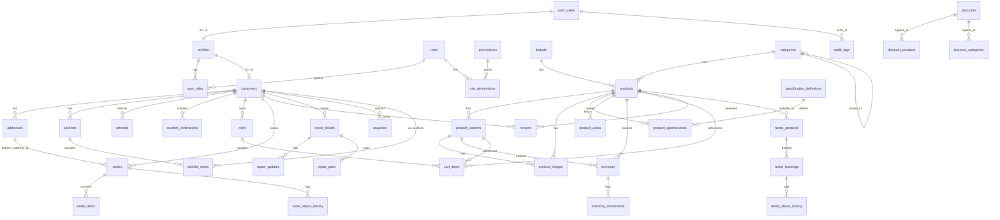

# Phase 2 — Database Architecture (review before migrations)

Schema name throughout: `public` (app tables) + Supabase-managed `auth`, `storage` schemas.
All PKs are `uuid default gen_random_uuid()` unless noted. All tables have `created_at timestamptz not null default now()`; mutable tables also have `updated_at timestamptz not null default now()` maintained by a shared `set_updated_at()` trigger.

## ERD (Mermaid)



`corporate_enquiries` and `site_settings` are intentionally standalone (no FKs into the customer graph) and are omitted from the diagram for readability; they're detailed below.

## Table list (columns, keys, constraints, indexes)

Enums are Postgres `CREATE TYPE ... AS ENUM`. Every enum is created in `0002_enums.sql` so later migrations just reference the type name.

### `profiles`
- `id uuid PK` (FK → `auth.users.id`, `ON DELETE CASCADE`)
- `full_name text`, `phone text`, `avatar_path text`
- `created_at`, `updated_at`
- Created automatically by trigger `handle_new_user()` on `auth.users` insert.

### `roles`
- `id uuid PK`, `name text UNIQUE NOT NULL` (`admin|staff|sales|technician|customer`), `description text`

### `permissions`
- `id uuid PK`, `key text UNIQUE NOT NULL` (e.g. `products.write`), `description text`

### `role_permissions`
- `role_id uuid FK→roles(id) ON DELETE CASCADE`, `permission_id uuid FK→permissions(id) ON DELETE CASCADE`
- PK `(role_id, permission_id)`

### `user_roles`
- `user_id uuid FK→auth.users(id) ON DELETE CASCADE`, `role_id uuid FK→roles(id) ON DELETE CASCADE`
- PK `(user_id, role_id)`
- Index on `user_id` (lookups happen on every permission check)

### `customers`
- `id uuid PK` (FK→`profiles(id)` `ON DELETE CASCADE`)
- `referral_code text UNIQUE NOT NULL DEFAULT` (generated via function, collision-checked)
- `student_status student_status_enum NOT NULL DEFAULT 'none'`
- `created_at`, `updated_at`

### `addresses`
- `id uuid PK`, `customer_id uuid FK→customers(id) ON DELETE CASCADE`
- `label text`, `line1 text NOT NULL`, `line2 text`, `city text NOT NULL`, `is_default boolean NOT NULL DEFAULT false`
- `created_at`, `updated_at`
- Partial unique index: one default address per customer (`WHERE is_default`)

### `brands`
- `id uuid PK`, `name text UNIQUE NOT NULL`, `slug text UNIQUE NOT NULL`, `logo_path text`, `created_at`, `updated_at`

### `categories`
- `id uuid PK`, `name text NOT NULL`, `slug text UNIQUE NOT NULL`
- `parent_id uuid FK→categories(id) ON DELETE SET NULL`, `display_order int NOT NULL DEFAULT 0`
- `created_at`, `updated_at`
- Index on `parent_id`

### `products`
- `id uuid PK`, `sku text UNIQUE NOT NULL`, `slug text UNIQUE NOT NULL`, `name text NOT NULL`
- `brand_id uuid FK→brands(id) ON DELETE SET NULL`, `category_id uuid FK→categories(id) ON DELETE RESTRICT`
- `product_type product_type_enum NOT NULL`, `condition condition_enum NOT NULL DEFAULT 'new'`
- `description text`, `base_price numeric(12,2) NOT NULL CHECK (base_price >= 0)`
- `sale_price numeric(12,2) CHECK (sale_price IS NULL OR sale_price < base_price)`
- `warranty_text text`, `status product_status_enum NOT NULL DEFAULT 'draft'`
- `is_featured boolean NOT NULL DEFAULT false`
- `seo_title text`, `seo_description text`, `view_count bigint NOT NULL DEFAULT 0`
- `raw_attributes jsonb NOT NULL DEFAULT '{}'::jsonb` (free-form extras only, not a substitute for `product_specifications`)
- `created_at`, `updated_at`
- Indexes: `(status, category_id)`, `(brand_id)`, GIN `to_tsvector('english', name || ' ' || sku || ' ' || coalesce(description,''))` for search, GIN on `raw_attributes`

### `specification_definitions`
- `id uuid PK`, `product_type product_type_enum NOT NULL`, `key text NOT NULL`
- `label text NOT NULL`, `data_type spec_data_type_enum NOT NULL`, `unit text`, `display_order int NOT NULL DEFAULT 0`
- UNIQUE `(product_type, key)`

### `product_variants`
- `id uuid PK`, `product_id uuid FK→products(id) ON DELETE CASCADE`
- `sku text UNIQUE NOT NULL`, `name text NOT NULL`
- `price numeric(12,2) NOT NULL CHECK (price >= 0)`, `sale_price numeric(12,2) CHECK (sale_price IS NULL OR sale_price < price)`
- `is_default boolean NOT NULL DEFAULT false`, `status variant_status_enum NOT NULL DEFAULT 'active'`
- `created_at`, `updated_at`
- Partial unique: one `is_default` per `product_id`

### `product_specifications`
- `id uuid PK`, `product_id uuid FK→products(id) ON DELETE CASCADE`
- `variant_id uuid FK→product_variants(id) ON DELETE CASCADE NULL`
- `spec_definition_id uuid FK→specification_definitions(id) ON DELETE RESTRICT`
- `value text NOT NULL`
- UNIQUE `(product_id, variant_id, spec_definition_id)`

### `product_images`
- `id uuid PK`, `product_id uuid FK→products(id) ON DELETE CASCADE`
- `variant_id uuid FK→product_variants(id) ON DELETE CASCADE NULL`
- `storage_path text NOT NULL`, `alt_text text`, `display_order int NOT NULL DEFAULT 0`, `is_primary boolean NOT NULL DEFAULT false`
- `created_at`, `updated_at`
- Partial unique: one `is_primary` per `(product_id, variant_id)`

### `product_views`
- `id uuid PK`, `product_id uuid FK→products(id) ON DELETE CASCADE`, `customer_id uuid FK→customers(id) ON DELETE SET NULL NULL`, `viewed_at timestamptz NOT NULL DEFAULT now()`
- Index `(product_id, viewed_at)`

### `inventory`
- `id uuid PK`, `product_id uuid FK→products(id) ON DELETE CASCADE`, `variant_id uuid FK→product_variants(id) ON DELETE CASCADE NULL`
- `quantity_on_hand int NOT NULL DEFAULT 0 CHECK (quantity_on_hand >= 0)`
- `quantity_reserved int NOT NULL DEFAULT 0 CHECK (quantity_reserved >= 0)`
- `low_stock_threshold int NOT NULL DEFAULT 3`
- `status inventory_status_enum NOT NULL DEFAULT 'out_of_stock'` (maintained by trigger from quantity vs threshold)
- `created_at`, `updated_at`
- UNIQUE `(product_id, variant_id)`

### `inventory_movements`
- `id uuid PK`, `inventory_id uuid FK→inventory(id) ON DELETE CASCADE`
- `movement_type movement_type_enum NOT NULL`, `quantity_delta int NOT NULL`
- `reference_type text`, `reference_id uuid` (polymorphic, nullable)
- `note text`, `created_by uuid FK→auth.users(id) ON DELETE SET NULL NULL`, `created_at`
- Append-only: no `updated_at`; RLS/grants deny UPDATE/DELETE for everyone but the migration owner.
- Index `(inventory_id, created_at)`

### `carts` / `cart_items`
- `carts`: `id uuid PK`, `customer_id uuid FK→customers(id) ON DELETE CASCADE NULL`, `session_token text UNIQUE NULL` (guest carts), `status cart_status_enum NOT NULL DEFAULT 'active'`, `created_at`, `updated_at`
  - `CHECK (customer_id IS NOT NULL OR session_token IS NOT NULL)`
- `cart_items`: `id uuid PK`, `cart_id uuid FK→carts(id) ON DELETE CASCADE`, `product_id uuid FK→products(id) ON DELETE CASCADE`, `variant_id uuid FK→product_variants(id) ON DELETE CASCADE NULL`, `quantity int NOT NULL CHECK (quantity > 0)`
  - UNIQUE `(cart_id, product_id, variant_id)`

### `orders`
- `id uuid PK`, `order_number text UNIQUE NOT NULL`
- `customer_id uuid FK→customers(id) ON DELETE SET NULL NULL`
- `guest_name text`, `guest_phone text`, `guest_email text`
- `CHECK (customer_id IS NOT NULL OR (guest_name IS NOT NULL AND guest_phone IS NOT NULL))`
- `subtotal numeric(12,2) NOT NULL`, `discount_total numeric(12,2) NOT NULL DEFAULT 0`, `total numeric(12,2) NOT NULL`
- `currency text NOT NULL DEFAULT 'MWK'`
- `payment_method text NOT NULL`, `payment_status payment_status_enum NOT NULL DEFAULT 'unpaid'`
- `order_status order_status_enum NOT NULL DEFAULT 'pending'`
- `fulfillment_type fulfillment_type_enum NOT NULL`, `delivery_address_id uuid FK→addresses(id) ON DELETE SET NULL NULL`
- `notes text`, `created_at`, `updated_at`
- Index `(customer_id)`, `(order_status)`

### `order_items`
- `id uuid PK`, `order_id uuid FK→orders(id) ON DELETE CASCADE`
- `product_id uuid FK→products(id) ON DELETE RESTRICT`, `variant_id uuid FK→product_variants(id) ON DELETE RESTRICT NULL`
- `product_name_snapshot text NOT NULL`, `sku_snapshot text NOT NULL`
- `unit_price numeric(12,2) NOT NULL`, `quantity int NOT NULL CHECK (quantity > 0)`, `discount_amount numeric(12,2) NOT NULL DEFAULT 0`, `line_total numeric(12,2) NOT NULL`

### `order_status_history`
- `id uuid PK`, `order_id uuid FK→orders(id) ON DELETE CASCADE`, `from_status text`, `to_status text NOT NULL`, `changed_by uuid FK→auth.users(id) ON DELETE SET NULL NULL`, `note text`, `created_at`

### `discounts` / `discount_products` / `discount_categories`
- `discounts`: `id uuid PK`, `name text NOT NULL`, `type discount_type_enum NOT NULL`, `value numeric(12,2) NOT NULL CHECK (value > 0)`, `scope discount_scope_enum NOT NULL`, `min_quantity int`, `min_order_total numeric(12,2)`, `max_discount_amount numeric(12,2)`, `starts_at timestamptz`, `ends_at timestamptz`, `is_active boolean NOT NULL DEFAULT true`, `created_at`, `updated_at`
  - `CHECK (ends_at IS NULL OR starts_at IS NULL OR ends_at > starts_at)`
  - `CHECK (type <> 'percentage' OR value <= 100)`
- `discount_products (discount_id FK, product_id FK)` PK composite, both `ON DELETE CASCADE`
- `discount_categories (discount_id FK, category_id FK)` PK composite, both `ON DELETE CASCADE`

### `reviews`
- `id uuid PK`, `product_id uuid FK→products(id) ON DELETE CASCADE`, `customer_id uuid FK→customers(id) ON DELETE SET NULL NULL`
- `rating int NOT NULL CHECK (rating BETWEEN 1 AND 5)`, `title text`, `comment text`
- `status review_status_enum NOT NULL DEFAULT 'pending'`, `created_at`
- Index `(product_id, status)`

### `student_verifications`
- `id uuid PK`, `customer_id uuid FK→customers(id) ON DELETE CASCADE`
- `full_name text NOT NULL`, `institution text NOT NULL`, `student_id_number text NOT NULL`, `phone text NOT NULL`, `email text NOT NULL`
- `document_path text` (private bucket key)
- `status verification_status_enum NOT NULL DEFAULT 'pending'`
- `reviewed_by uuid FK→auth.users(id) ON DELETE SET NULL NULL`, `reviewed_at timestamptz`, `expires_at timestamptz`
- `created_at`, `updated_at`

### `referrals`
- `id uuid PK`, `referrer_customer_id uuid FK→customers(id) ON DELETE CASCADE`
- `referred_customer_id uuid FK→customers(id) ON DELETE SET NULL NULL`, `referred_order_id uuid FK→orders(id) ON DELETE SET NULL NULL`
- `status referral_status_enum NOT NULL DEFAULT 'pending'`, `reward_amount numeric(12,2)`, `reward_status reward_status_enum NOT NULL DEFAULT 'pending'`
- `created_at`, `updated_at`
- `CHECK (referrer_customer_id <> referred_customer_id)`
- UNIQUE `(referrer_customer_id, referred_customer_id)`

### `rental_products`
- `id uuid PK`, `product_id uuid FK→products(id) ON DELETE CASCADE`
- `daily_rate numeric(12,2)`, `weekly_rate numeric(12,2)`, `monthly_rate numeric(12,2)`, `deposit_amount numeric(12,2)`, `is_available boolean NOT NULL DEFAULT true`
- `created_at`, `updated_at`

### `rental_bookings`
- `id uuid PK`, `rental_product_id uuid FK→rental_products(id) ON DELETE RESTRICT`
- `customer_id uuid FK→customers(id) ON DELETE SET NULL NULL`, `guest_name text`, `guest_phone text`, `guest_email text`
- `start_date date NOT NULL`, `end_date date NOT NULL`, `quantity int NOT NULL DEFAULT 1 CHECK (quantity > 0)`
- `status rental_status_enum NOT NULL DEFAULT 'requested'`, `notes text`, `total_charge numeric(12,2)`
- `created_at`, `updated_at`
- `CHECK (end_date >= start_date)`

### `rental_status_history`
- `id uuid PK`, `booking_id uuid FK→rental_bookings(id) ON DELETE CASCADE`, `from_status text`, `to_status text NOT NULL`, `changed_by uuid FK→auth.users(id) ON DELETE SET NULL NULL`, `note text`, `created_at`

### `repair_tickets`
- `id uuid PK`, `ticket_number text UNIQUE NOT NULL`
- `customer_id uuid FK→customers(id) ON DELETE SET NULL NULL`, `guest_name text`, `guest_phone text`, `guest_email text`
- `device_type text NOT NULL`, `brand text`, `model text`, `serial_number text`
- `problem_description text NOT NULL`, `accessories_received text`
- `status repair_status_enum NOT NULL DEFAULT 'checked_in'`
- `assigned_technician_id uuid FK→auth.users(id) ON DELETE SET NULL NULL`
- `quote_amount numeric(12,2)`, `quote_approved_at timestamptz`
- `created_at`, `updated_at`
- Index `(assigned_technician_id)`, `(status)`

### `repair_updates`
- `id uuid PK`, `ticket_id uuid FK→repair_tickets(id) ON DELETE CASCADE`, `note text NOT NULL`, `is_internal boolean NOT NULL DEFAULT false`, `created_by uuid FK→auth.users(id) ON DELETE SET NULL NULL`, `created_at`

### `repair_parts`
- `id uuid PK`, `ticket_id uuid FK→repair_tickets(id) ON DELETE CASCADE`, `part_name text NOT NULL`, `cost numeric(12,2) NOT NULL DEFAULT 0`, `quantity int NOT NULL DEFAULT 1`

### `enquiries`
- `id uuid PK`, `customer_id uuid FK→customers(id) ON DELETE SET NULL NULL`, `name text NOT NULL`, `phone text`, `email text`, `topic enquiry_topic_enum NOT NULL`, `message text NOT NULL`, `status enquiry_status_enum NOT NULL DEFAULT 'new'`, `created_at`

### `corporate_enquiries`
- `id uuid PK`, `organisation_name text NOT NULL`, `contact_person text NOT NULL`, `phone text NOT NULL`, `email text NOT NULL`, `products_required text`, `quantity int`, `budget numeric(12,2)`, `delivery_location text`, `additional_requirements text`, `status corporate_status_enum NOT NULL DEFAULT 'new'`, `created_at`, `updated_at`

### `notifications`
- `id uuid PK`, `recipient_user_id uuid FK→auth.users(id) ON DELETE CASCADE NULL`, `recipient_role_id uuid FK→roles(id) ON DELETE CASCADE NULL`, `type text NOT NULL`, `title text NOT NULL`, `body text`, `is_read boolean NOT NULL DEFAULT false`, `related_entity_type text`, `related_entity_id uuid`, `created_at`
- `CHECK (recipient_user_id IS NOT NULL OR recipient_role_id IS NOT NULL)`

### `site_settings`
- `id uuid PK`, `key text UNIQUE NOT NULL`, `value jsonb NOT NULL`, `is_public boolean NOT NULL DEFAULT false`, `updated_at`
- Seeded keys (values empty/disabled until you confirm, per your instruction #10): `business_info`, `hours`, `social_links`, `payment_methods`, `rental_settings`, `repair_settings`, `student_discount_settings`, `referral_settings`, `low_stock_threshold_default`, `site_statistics` (`{"enabled": false, "products": null, "years": null, "happy_clients": null}`)

### `wishlists` / `wishlist_items`
- `wishlists`: `id uuid PK`, `customer_id uuid UNIQUE FK→customers(id) ON DELETE CASCADE`
- `wishlist_items`: `id uuid PK`, `wishlist_id uuid FK→wishlists(id) ON DELETE CASCADE`, `product_id uuid FK→products(id) ON DELETE CASCADE`, `variant_id uuid FK→product_variants(id) ON DELETE CASCADE NULL`, `added_at timestamptz NOT NULL DEFAULT now()`
  - UNIQUE `(wishlist_id, product_id, variant_id)`

### `audit_logs`
- `id uuid PK`, `actor_id uuid FK→auth.users(id) ON DELETE SET NULL NULL`, `action text NOT NULL`, `entity_type text NOT NULL`, `entity_id uuid`, `metadata jsonb NOT NULL DEFAULT '{}'::jsonb`, `created_at`
- Insert-only; no UPDATE/DELETE grants to any application role.

## Role / permission model

Seeded roles: `admin`, `staff`, `sales`, `technician`, `customer`.
Seeded permissions (from your list): `products.read/write/delete`, `inventory.read/write/adjust`, `orders.read/write/cancel`, `customers.read/write`, `repairs.read/write`, `rentals.read/write`, `reviews.read/moderate`, `students.read/verify`, `reports.read`, `settings.read/write`, `users.manage`, `roles.manage`, `audit_logs.read`.

Default grants (seed data, changeable later via `/admin/users` in Phase 6):
- **admin** → every permission.
- **staff** → `products.read/write`, `inventory.read/write`, `orders.read/write`, `customers.read/write`, `reviews.read/moderate`, `students.read`, `reports.read`.
- **sales** → `orders.read/write`, `customers.read`, `reports.read`.
- **technician** → `repairs.read/write`.
- **customer** → no rows in `role_permissions` (customers act only on their own data via ownership-based RLS policies, not the permission-key system).

## `has_permission()` function

```sql
create or replace function public.has_permission(uid uuid, permission_key text)
returns boolean
language sql
stable
security definer
set search_path = public
as $$
  select exists (
    select 1
    from public.user_roles ur
    join public.role_permissions rp on rp.role_id = ur.role_id
    join public.permissions p on p.id = rp.permission_id
    where ur.user_id = uid
      and p.key = permission_key
  );
$$;

revoke all on function public.has_permission(uuid, text) from public;
grant execute on function public.has_permission(uuid, text) to authenticated, anon;
```

`security definer` is required so the function can read `role_permissions`/`permissions` (which ordinary users have no direct RLS access to) while still being safely callable by anyone — it returns only a boolean, never the underlying rows. This is the same function both `lib/auth/permissions.ts` (application layer) and RLS policies (database layer) call, so the two layers can never drift out of sync.

Also added: `public.has_role(uid uuid, role_name text) returns boolean` (same pattern, checks `user_roles`/`roles`), used in RLS policies where a coarse role check reads more clearly than a fine permission key (e.g. "is this an admin").

## RLS strategy (representative policies; full SQL in migrations)

Enabled on **every** `public` table. Pattern: `USING`/`WITH CHECK` clauses call `has_permission()`/`has_role()` or compare `auth.uid()` to an ownership column — never a bare `true`.

| Table | Public/anon | Authenticated customer | Staff/sales/admin/technician |
|---|---|---|---|
| `products`, `categories`, `brands` | `SELECT` where `status='published'` (products) / always (categories, brands) | same as public | full via `products.write` |
| `product_images`, `product_specifications`, `product_variants` | `SELECT` following parent product's published status | same | `products.write` |
| `reviews` | `SELECT` where `status='approved'` | own rows any status; `INSERT` own | `reviews.moderate` for `UPDATE` |
| `orders`, `order_items`, `order_status_history` | none | own (`customer_id = auth.uid()` via `customers.id = profiles.id = auth.uid()`) | `orders.read`/`orders.write` |
| `carts`, `cart_items` | guest via `session_token` match (checked in Server Action, not raw client policy, since anon has no stable identity for RLS) | own | staff generally not needed |
| `repair_tickets`, `repair_updates` (`is_internal=false` only), `repair_parts` | none | own | assigned technician (`assigned_technician_id = auth.uid()`) via `repairs.read`; full via `repairs.write` |
| `student_verifications` | none | own (`INSERT`/`SELECT`) | `students.verify` for review/approve; document path never public |
| `referrals` | none | own (`referrer_customer_id = auth.uid()`) | admin only |
| `rental_bookings`, `rental_status_history` | none | own | `rentals.read`/`rentals.write` |
| `enquiries`, `corporate_enquiries` | `INSERT` only (anyone can submit) | own `SELECT` | `customers.read`-equivalent staff access |
| `inventory`, `inventory_movements` | none | none | `inventory.read`/`inventory.write`/`inventory.adjust`; movements are insert-only even for admins (append-only ledger) |
| `discounts`, `discount_products`, `discount_categories` | `SELECT` where `is_active` (for price display) | same | `settings.write`-tier permission for writes |
| `site_settings` | `SELECT` where `is_public=true` | same | `settings.read`/`settings.write` |
| `audit_logs` | none | none | `audit_logs.read` for `SELECT`; `INSERT` only via `security definer` helper, never direct client insert |
| `notifications` | none | own (`recipient_user_id = auth.uid()`) or matching role | admin can read all |
| `wishlists`, `wishlist_items`, `addresses` | none | own | admin read via `customers.read` if needed |

Security test scenarios from your item #13 are captured as explicit negative-policy tests (documented, to be run against a live project) in the "Tests not executed" section of the Phase 2 report.

## Storage bucket strategy

| Bucket | Public? | Contents | Policy summary |
|---|---|---|---|
| `product-images` | **Public read** | Product/variant photos | `SELECT` open to all; `INSERT`/`UPDATE`/`DELETE` require `has_permission(auth.uid(), 'products.write')` |
| `repair-documents` | **Private** | Repair-related attachments if added later | No public policy; access only via server-generated signed URL after a `repairs.read`/ownership check in application code |
| `student-documents` | **Private** | Student ID / proof-of-enrolment uploads | No public policy; access only via signed URL after `students.verify` check, or the owning customer via a scoped signed URL |

Path convention: `{bucket}/{owning_entity_id}/{file_id}.{ext}` everywhere, so a policy can pattern-match the owning ID out of the path where useful (`storage.foldername(name)`).

## Audit logging strategy

A single `log_audit_event()` `security definer` Postgres function, called from triggers on the tables listed in your brief (`products`, `inventory` adjustments, `orders.order_status`, `student_verifications.status`, `repair_tickets` updates, `discounts`, `user_roles`) — so audit writes happen automatically at the database layer and can't be forgotten by an application code path. Triggers are added per-table in their own migration alongside the table itself, rather than one giant end-of-file trigger dump.

## Auth configuration (documented per your item #2)

**Enabled for both dev and prod:** Email/password provider, "Confirm email" required, password reset ("forgot password") enabled, minimum password length 8 (enforced by Zod today; Supabase Auth's own minimum can be raised to match in Project Settings → Auth).
**Explicitly NOT enabled:** phone auth, Google/Facebook/any OAuth provider — until you request them.
**Redirect URLs to configure in Supabase Auth settings:** `http://localhost:3000/**` (dev), your eventual production URL (added only once you approve a deployment target).

---

Proceeding to the numbered migrations implementing exactly this design.
